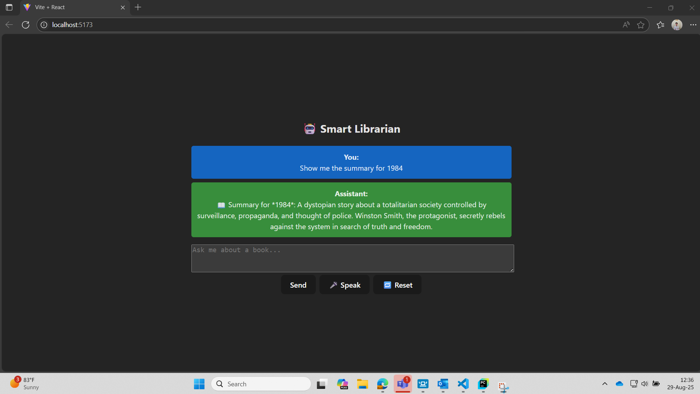

# 📚 Smart Librarian - DavaX - AI with RAG & Tool Completion 

Un chatbot inteligent cu rol de bibliotecar digital, care permite interacțiunea prin text, voce și LLMs, folosind o interfață modernă și backend scalabil.

---

## 🧰 Tehnologii folosite

- **fastapi** – The main web framework  
- **uvicorn** – Runs the FastAPI app as a local web server  
- **pydantic** – Data validation & serialization  
- **sqlalchemy** – Providing SQL and ORM (Object Relational Mapping) features for database access  
- **chromadb** – Storing and querying the embeddings for LLM apps using RAG approach  
- **openai** – Providing tools to interact with OpenAI API  
- **speech_recognition** – Used for speech-to-text conversion  
- **pyttsx3** – Used for text-to-speech conversion  

---

## 📘 Tutorial de utilizare a aplicației de chatbot cu rol de Bibliotecar

### 🔹 Pasul 1 – Clonarea repository-ului în PyCharm

Vom clona repo-ul din GitHub în PyCharm folosind comanda:

```bash
git clone https://github.com/AndreiTheG/SmartLibrarian.git
```

---

### 🔹 Pasul 2 – Crearea venv-ului și instalarea pachetelor necesare

```bash
pip install fastapi uvicorn pydantic sqlalchemy chromadb openai speech_recognition pyttsx3
```

---

### 🔹 Pasul 3 – Instalarea framework-urilor de frontend (React + Vite)

Asigură-te că ai Node.js instalat, apoi rulează:

```bash
npm create vite@latest frontend --template react
cd frontend
npm install
```

---

### 🔹 Pasul 4 – Setarea cheii OpenAI API

Setează cheia în terminal:

```bash
export OPENAI_API_KEY=your_api_key_here
```

---

## 🧠 Structura aplicației

### 🔸 Pasul 5.1 – Rularea `main.py`

Rulează serverul FastAPI și definește ruta `/chat`.

### 🔸 Pasul 5.2 – Modele Pydantic

Crează folderul `model` și adaugă:

- `ChatRequest.py`
- `SummaryBook.py`
- `SummaryBookModel.py`

### 🔸 Pasul 5.3 – Scriptul `Database.py`

Creează baza SQLite cu datele despre cărți.

### 🔸 Pasul 5.4 – Definirea rutelor API

- `POST` – Inserare date carte și mesaje
- `GET` – Extragere date după ID

### 🔸 Pasul 5.5 – Rularea `load_db_to_chroma.py`

```bash
python backend/chatbot/load_db_to_chroma.py
```

### 🔸 Pasul 5.6 – Pornirea CLI

```bash
python -m backend.chatbot.cli_bot
```

---

## 🌐 Frontend

### 🔸 Pasul 6.1 – Instalare Axios

```bash
npm install axios
```

### 🔸 Pasul 6.2 – Creare `Chat.jsx` + integrare cu `App.jsx`

Folosește endpoint-ul `http://localhost:8000/chat`.

---

### 🔸 Pasul 7 – Activare CORS în FastAPI

Adaugă în `main.py`:

```python
origins = ["http://localhost:5173"]
```

---

## 🚀 Rularea aplicației

### ▶️ Backend

```bash
uvicorn backend.main:app --reload
```

### ▶️ Frontend

```bash
npm run dev
```

Accesează [http://localhost:5173](http://localhost:5173)

---

## 📚 Funcționalități principale

- 🔍 Inserare și regăsire rezumate de carte  
- 🤖 Interacțiune cu chatbot (text + voce)  
- 📈 Vectorizare în ChromaDB  
- 🧠 Generare de rezumate și recomandări folosind GPT  

---

## ✅ Recomandări

- Rulează backend și frontend în paralel  
- Reîncarcă baza Chroma dacă adaugi cărți noi  
- Aplicația este ușor extensibilă pentru alte integrări LLM/UI

## Interfața aplicației:

